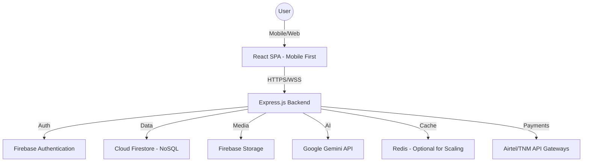

# Zathu Social Platform Documentation

## 1. Full System Architecture

## 2. Database Schema (Firestore)

### `users` (Collection)
- `uid`: string (Primary Key)
- `phoneNumber`: string
- `displayName`: string
- `bio`: string
- `photoURL`: string
- `coverURL`: string
- `location`: string
- `followersCount`: number
- `followingCount`: number
- `isVerified`: boolean
- `createdAt`: timestamp

### `posts` (Collection)
- `postId`: string (Primary Key)
- `authorId`: string (Ref: users)
- `content`: string
- `media`: array of { type: 'image'|'video', url: string }
- `likesCount`: number
- `commentsCount`: number
- `sharesCount`: number
- `tags`: array of strings
- `isModerated`: boolean
- `createdAt`: timestamp

### `messages` (Collection)
- `chatId`: string (Primary Key)
- `participants`: array of uids
- `lastMessage`: string
- `updatedAt`: timestamp
- `subcollection: messages`
    - `senderId`: string
    - `text`: string
    - `mediaURL`: string
    - `isRead`: boolean
    - `createdAt`: timestamp

### `marketplace` (Collection)
- `itemId`: string
- `sellerId`: string
- `title`: string
- `description`: string
- `price`: number (MK)
- `category`: string
- `location`: string
- `images`: array of strings
- `status`: 'active' | 'sold'

## 3. Backend API Structure

- `POST /api/auth/otp`: Send OTP to phone
- `POST /api/auth/verify`: Verify OTP and return JWT
- `POST /api/ai/moderate`: Analyze content for safety
- `POST /api/ai/translate`: Translate post content
- `POST /api/ai/caption`: Generate captions for topics
- `POST /api/payments/initiate`: Start mobile money transaction
- `GET /api/admin/stats`: Get platform analytics (Admin only)

## 4. Frontend Component Structure

- `src/components/`
    - `Layout.tsx`: Main wrapper with Navbar
    - `Navbar.tsx`: Bottom navigation for mobile
    - `PostCard.tsx`: Reusable feed item
    - `VideoPlayer.tsx`: Vertical video component
    - `ChatBubble.tsx`: Message item
    - `MarketItem.tsx`: Marketplace card
- `src/pages/`
    - `Home.tsx`: News feed
    - `Videos.tsx`: Short video discovery
    - `Marketplace.tsx`: Buy/sell items
    - `Messages.tsx`: Chat list and rooms
    - `Profile.tsx`: User profile and settings
    - `Admin.tsx`: Dashboard for moderators

## 5. AI Integration Points

1. **Content Moderation**: Every post is scanned by Gemini before being visible to others.
2. **Smart Feed**: Gemini analyzes user interests to rank posts in the "For You" feed.
3. **Translation**: Real-time translation between English and Chichewa for inclusive communication.
4. **Caption Assistant**: Helping users create engaging content with AI-suggested captions.
5. **Zathu AI**: A 24/7 assistant to help users navigate the app and answer local queries.

## 6. Monetization Strategy

1. **Sponsored Posts**: Local businesses can pay to boost their posts or products.
2. **Marketplace Commissions**: Small fee for high-value transactions (e.g., vehicles).
3. **Premium Badges**: Subscription for "Verified" status and advanced analytics for creators.
4. **Data Bundles Partnerships**: Partnering with Airtel/TNM to offer "Zathu Bundles" (zero-rated data).

## 7. Deployment Guide

1. **Firebase Setup**: Enable Auth, Firestore, and Storage in the console.
2. **Environment Variables**: Add `GEMINI_API_KEY` and Firebase config to secrets.
3. **Build**: Run `npm run build`.
4. **Deploy**: Deploy to Cloud Run using the provided Dockerfile/configuration.
